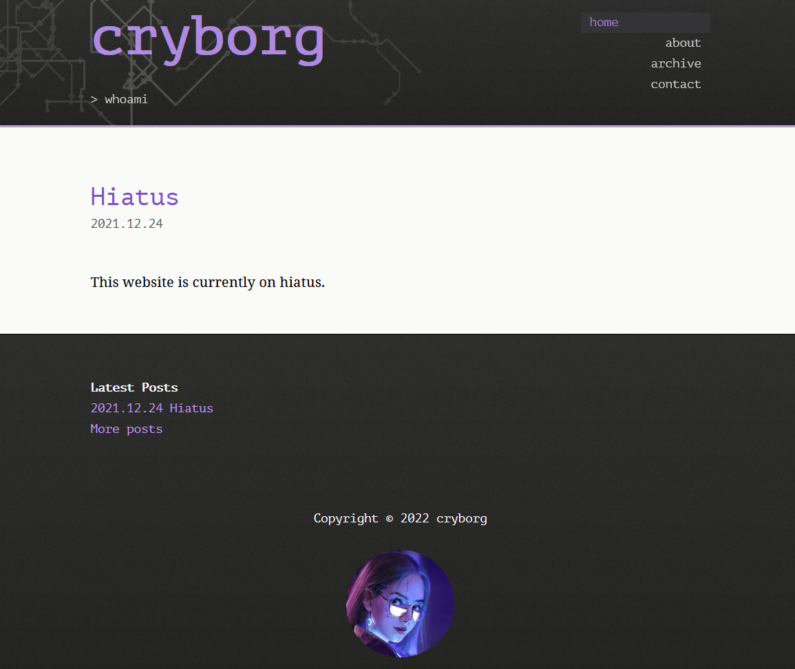

This repository contains the files used to generate [cryb.org](https://cryb.org/), using [Pelican](https://blog.getpelican.com/).

## Local setup

One-time setup on a new machine (requires Python 3.12+). On Ubuntu/WSL you may
also need `sudo apt install python3-venv` first.

```bash
python3 -m venv .venv                      # create an isolated virtualenv (gitignored)
.venv/bin/pip install -r requirements.txt  # install Pelican + Markdown into it
```

## Working locally

Activate the virtualenv (the prompt then shows `(.venv)`):

```bash
source .venv/bin/activate
```

Run a live dev server with auto-reload at <http://localhost:8000>:

```bash
pelican --listen --autoreload
```

Build the production site (what GitHub Actions deploys) into `output/`:

```bash
pelican content -s publishconf.py -o output
```

Run `deactivate` when finished. To skip activation, prefix commands with
`.venv/bin/` instead, e.g. `.venv/bin/pelican --listen --autoreload`.

## Deployment

Pushing to `master` triggers the GitHub Actions workflow
(`.github/workflows/pages.yml`), which builds with `publishconf.py` and deploys
to GitHub Pages. The custom domain is set via the `content/CNAME` file, which
Pelican copies to the output root on every build.

## Screenshot


